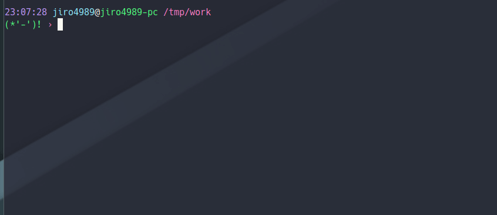

=========
yourutils
=========

|gh-actions|

yourutils are tiny useful cli commands.

.. contents:: Table of contents
   :depth: 3

Development
===========

Nim 1.0.0

Usage
=====

flat
----

Flats

.. code-block:: shell

   $ seq 5 | flat
   1 2 3 4 5

   $ seq 5 | flat -n 2
   1 2
   3 4
   5

   $ seq 5 | flat -d ,
   1,2,3,4,5

rep
----

Repeat words.

.. code-block:: shell

   $ rep 5 A
   AAAAA

   $ echo 'A B' | rep 5 -i
   A BA BA BA BA B

   $ rep 1 3 5 A
   A
   AAA
   AAAAA

   $ rep $(seq 5) A
   A
   AA
   AAA
   AAAA
   AAAAA

ucut
----

Unicode cut.

.. code-block:: shell

   $ echo １あ２あ３ | ucut -d あ -f 1,2
   １ ２

codepoint
---------

Prints code point.

.. code-block:: shell

   % echo hello world | codepoint
   char code_point code_point(hex)
   h 104 \U68
   e 101 \U65
   l 108 \U6C
   l 108 \U6C
   o 111 \U6F
     32 \U20
   w 119 \U77
   o 111 \U6F
   r 114 \U72
   l 108 \U6C
   d 100 \U64

align
-----

Align texts.

.. code-block:: shell

   % echo $'123\nあいう\nえお' | align right 
      123
   あいう
     えお

   % echo $'1234\nああああああ\nうえお' | align center -p =  
   ====1234====
   ああああああ
   ===うえお===

aggr
----

.. code-block:: shell

   cat cpu.csv | aggr -d , -f 2,3
   aggr -d , -f 2,3 cpu.csv mem.csv

tb
----

Convert from text input stream like table to Table format (markdown, html or
asciidoc). A default delimiter of input stream is the `TAB`. You can change a
default delimiter with `-d` option.

.. code-block:: shell

   $ paste <(seq 5) <(seq 6 10) <(seq 11 15) | tb
   |1|6|11|
   |:---:|:---:|:---:|
   |2|7|12|
   |3|8|13|
   |4|9|14|
   |5|10|15|

   $ paste -d , <(seq 5) <(seq 6 10) <(seq 11 15) | tb -d , -f adoc
   [options="header"]
   |=================
   |1|6|11
   |2|7|12
   |3|8|13
   |4|9|14
   |5|10|15
   |=================

renames
-------

Rename files and directories recursively.
You can try `dry-run`.

.. code-block:: shell

   # Dry run is `--dry-run` or `-d`
   $ renames replace --dry-run -t _ target_dir
   $ renames replace -d -t _ target_dir
   # You can set multiple `--from-strs` or `-f`
   $ renames replace -f a -f b -f c -t "_" target_dir

   # Delete whitespace
   $ renames delete target_dir
   # Print remaming
   $ renames delete -p target_dir

   # To lower
   $ renames lower target_dir

   # To upper
   $ renames upper target_dir

zshprompt
---------

Zsh prompt.

Prompt is here.

.. code-block:: shell

   17:42:12 jiro4989@jiro4989-pc ~/src/github.com/jiro4989/yourutils master •
   (;^q^)? ›

And settings of `.zshrc` .

.. code-block:: shell

   readonly __ZSH_PROMPT_CMD="$HOME/.nimble/bin/zshprompt"

   autoload -Uz add-zsh-hook
   _nicy_prompt() {
     if type "$__ZSH_PROMPT_CMD" >& /dev/null; then
       PROMPT=$("$__ZSH_PROMPT_CMD")
     fi
   }
   add-zsh-hook precmd _nicy_prompt

tiff
----

Time diff.

.. code-block:: shell

   $ tiff 19:00 18:00
   3600 seconds

   $ tiff 19:00 18:00 -H
   1 hours

   $ tiff 19:00 18:00 -M
   60 minutes

jsonfmt
-------

Format json from stdin.

.. code-block:: shell

   $ echo '{"a":1, "b":true, "c":[1, 2, 3], "d":{"a":1, "b":"test"}}' | jsonfmt
   {
     "a": 1,
     "b": true,
     "c": [
       1,
       2,
       3
     ],
     "d": {
       "a": 1,
       "b": "test"
     }
   }

mcp
----

Copy multiple files or directories with editor

|demo-mcp|

msel
----

Select input lines with editor

marc
----

Archive multiple files

Install
=======

.. code-block:: shell

   nimble install https://github.com/jiro4989/yourutils

Download binary from `Release <https://github.com/jiro4989/yourutils/releases>`_.

License
=======

MIT

.. |gh-actions| image:: https://github.com/jiro4989/yourutils/workflows/build/badge.svg
   :target: https://github.com/jiro4989/yourutils/actions
.. |nimble-version| image:: https://nimble.directory/ci/badges/yourutils/version.svg
   :target: https://nimble.directory/ci/badges/yourutils/nimdevel/output.html
.. |nimble-install| image:: https://nimble.directory/ci/badges/yourutils/nimdevel/status.svg
   :target: https://nimble.directory/ci/badges/yourutils/nimdevel/output.html
.. |nimble-docs| image:: https://nimble.directory/ci/badges/yourutils/nimdevel/docstatus.svg
   :target: https://nimble.directory/ci/badges/yourutils/nimdevel/doc_build_output.html

